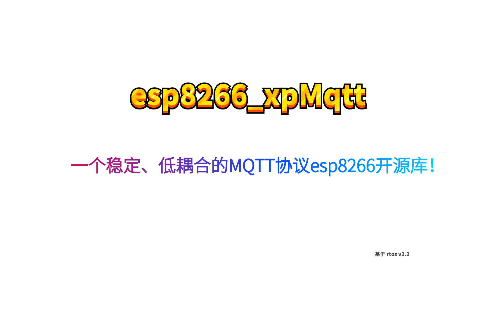

  

 

目录
--------------

* [前言](#前言)
* [内存优化](#内存优化)
* [如何编译工程](#如何编译工程)
* [如何集成到您的工程](#如何集成到您的工程)

--------------
## 前言

- &nbsp;&nbsp;&nbsp;对于`esp8266`的`MQTT`通讯的稳定性要求一直是个热点，在`NONOS SDK`上的例程还好，但是在`rtos`上就不是那么乐观了！为此我特意去官方的`GitHub`上提出问题，但是并不是乐意，碰巧，在我创建的`QQ`交流群上遇到同样需要以下需求的彭工，于是我们俩就开始琢磨怎么能够良好地在`esp8266`上实现一个具有稳定性好、低耦合的库，并且开源出来！

- 因为姓氏缘故，我们因此纪念它为`esp8266-xpMqtt`！更好地服务各位物联网的爱好者！
  
  
## 内存优化
  
- 1.路由器热点（AP热点）断开外网，设备`MQTT`协议的底层`TCP`连接重连，内存波动在理想的范围内！

- 2.当设备一次或多次与路由器(AP热点）断开连接，能够自己重连`MQTT`服务器，而且内存波动在理想的范围内！
 
- 3.以上是本仓库对于乐鑫原来的功能新增的特性！按照我们的设计要求，必须要充分利用`rtos`实时系统的特性，最大效率地合理调用分配`esp8266`的有限资源！

## 如何编译本工程

- 如果你的是`Linux`系统，请遵循乐鑫的方法，先手动指定`SDK`路径，然后`./gen_misc.sh`进行编译！

- 如果你的是`windows`系统 + `eclipes`环境，可以参考我博客的方法，先在工程下面的`MakeFile`文件手动指定`SDK`路径，然后进行编译！

## 如何集成到您的工程

- 为了更好地版本管理，我们仅仅提供静态库文件`libxpmqtt.a`和头文件，以及我们为您准备好在根目录的`xpmqtt`子目录里面！具体的使用如何集成，请参照我这篇篇博客 [链接](https://blog.csdn.net/xh870189248/article/details/80909216)！尤其要注意的一点是，你的`RTOS SDK`版本最好和本工程一样，否则会引发一些不必要的麻烦！请你放心，本工程的经过几天的稳定性测试，皆为良好！下面会分析出来！

